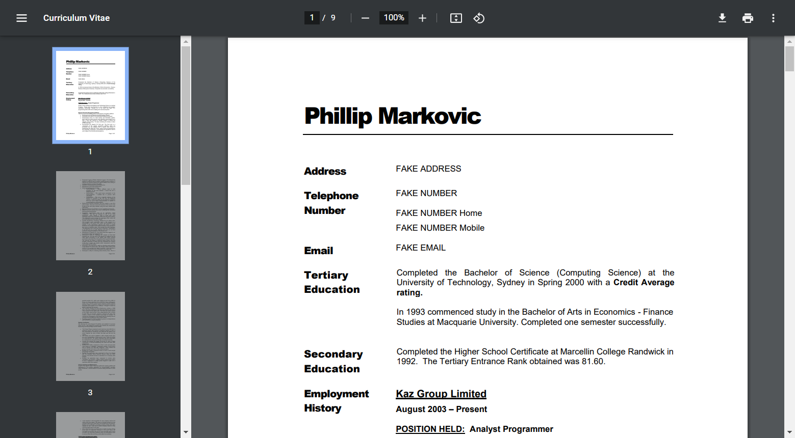
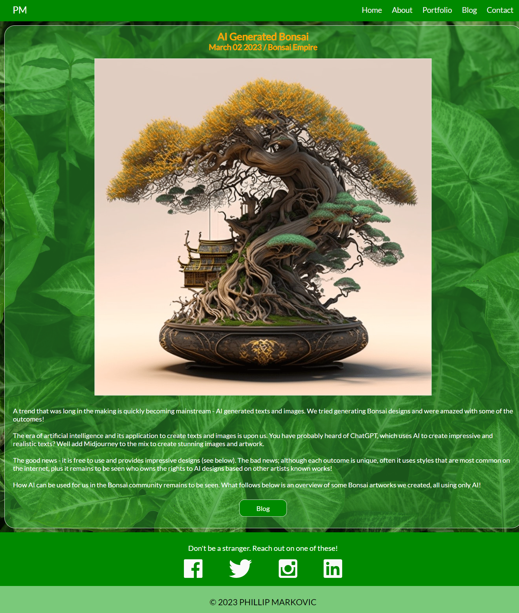

# PhillipMiguelMarkovic_T1A2

# Link (URL) to my published portfolio website.

https://phillip-miguel-markovic-t1-a2.vercel.app

# Link to GitHub Repository

https://github.com/phillipm-developer/PhillipMiguelMarkovic_T1A2

# Link to my Slide Deck Presentation

https://youtu.be/x8O3Jpu5xlU

# Purpose of my Portfolio Website

The purpose of my Portfolio Website is is to let others know about myself and showcase my work in a unique and personalised manner. My site is geared towards engaging employers in the technology sector, developers and IT professionals. 

This website is designed to generate interest and prospective job offers by demonstrating my skills and work experience. I want to show that I can develop commercial websites and that I am able to create captivating sites in specific industries as well as my own portfolio website.

# Functionality & Features of my Portfolio Website

## Navigation

The navigation bar for my portfolio website appears on every page. It is a version of a hamburger menu in that it switches from laying out all the menu options across the screen for larger displays to enabling a toggle button (3 horizontal lines) in the top right corner of the navigation bar. This happens when viewing the website with mobiles and tablets and makes the navigation bar more responsive. This allows access to any part of the site in no more than two clicks.

Navigation is simple in its conception and reinforces the notion of two clicks at most between any page. A good example of this can be seen at the bottom of each blog post. Once you have read the post a button appears beneath the last line of text. You can click this button to take you back the the main Blog page rather than having to move the mouse pointer back to the menu bar. This is a convenient solution.

## Colour Themes and Fonts

My interest in Bonsai trees and gardening in general can be seen in the thematic layout I have chosen which uses verdant colours and background images. I have used a small set of contrasting colours and font sizes so that the content can stand out and details are not overlooked by a visitor to the site.

The fonts used are a combination of Lato and Bree Serif. This has a softening effect on each page and broadens the appeal of the site. It has a relaxing effect on the user and keeps them engaged.

I also make extensive use of translucence for backgrounds and when hovering over links in keeping with this idea.

## Portfolio Presentation

My interest in gardening has been put to good use on my portfolio page which showcases the websites I have either developed or been a part of developing in a team. I have developed sites for gardening retailers, pet care companies and tour operators.

I have provided links to my web development work on the Portfolio page. I have presented the links in an eye catching manner. I developed a box container for each site which contains an image capturing the essence of each website and what each company does. The desktop version uses translucence when the mouse pointer hovers over the image indicating to the user that it is a link while impressing them with the effect.

## Blog

I took the idea of a box container for my portfolio and enhanced it so that it acts as preview card for the actual blog posts. This interaction permits the user to sample the article before commiting to reading the longform version in the post. The desktop version uses translucence when the mouse pointer hovers over the image like the portfolio page elements.

## Layout

The layout of each page is standardized. Each page has a clearly defined header, main section (for content), and footer. This allows code reuse between pages and provides a basic template for all pages. 

Please note that in this case there are two footers which are placed in a single container so they can be anchored to the bottom of the viewport as a single conceptual footer.

## Logo

I have my initials in the top left corner of the navigation bar which is a stand in for a graphical logo. Clicking on this logo will take the user back to my introductory homepage. This is a one click feature in mobile navigation where everything else relies on two clicks through the drop down menu. The logo is also an eye catching monogram that captivates the user.

## Dropdown Menu

The dropdown menu is enabled when the site is viewed through mobile devices. All tablets tested do not require the dropdown menu, only mobile phones. An interesting side effect of using the dropdown menu is the leafy background which springs toward the user when they open it up. This captivates and enhances the users experience of my site.

## Social Media and Contact Details

I have an integrated social media toobar in the footer of each page as well as a separate contact page to ensure multiple avenues of communication with users.

## Conclusion

The content I have produced is niche content. I have taken a consistent approach to creating and publishing this content. Taken together with the consistent look and feel between pages the user is left with the impression that I am an authority. I am more than competent at developing websites in the gardening, pet or tourism industries.

# Sitemap

# Screenshots

The following images are full screen captures of each page corresponding to the nodes in the sitemap. This means that you can see the full page from the top navigatiion bar to the footer (which you would normally scroll to see). These pages are displayed as pairs (one in full screen mode and one as a responsive mobile layout).

## Homepage
&nbsp;

&nbsp;

&nbsp;
## About
&nbsp;

&nbsp;

&nbsp;
## Resume
&nbsp;

&nbsp;
## Portfolio
&nbsp;

&nbsp;

&nbsp;
## Blog
&nbsp;

&nbsp;

&nbsp;
## Blog Post
&nbsp;

&nbsp;

&nbsp;
## Contact
&nbsp;

&nbsp;

&nbsp;
## Dropdown Menu for Mobile Devices
&nbsp;

&nbsp;
# Target Audience

As per the assignment brief "the target audience for the portfolio website is an employer looking to engage a developer and/or IT professional". Such an employer is likely to hold a senior position in a company either as a lead developer (technical team leader), project manager or a technical person who has moved up into a higher management role and has experience with recruitment. 

In any case their backround is technology, and my portfolio website is geared towards demonstrating key competencies in web and other development. My portfolio needs to demonstrate clear understanding of software development concepts and problem solving. It needs to convey that I can work in teams, and follow project plans through to completion.

An IT professional seeking a developer knows what all the pressure points are in the project(s) they are managing. They need to know that I am the "right fit" for the project and team I am working in. The social media bar and contact page enable quick communication. My social media links provide more insights into my interests and personality in addition to my About page.

From a tecchnical perspective, the IT professional will find a summary of my experience and a list of skills the I am proficient in. For a more comprehensive treatment of my skills and experience, they can view my full resume through a link on my About page.

# Technology Stack

The technology stack is the set of technologies used to develop and run the portfolio website. This can be separated out into the client side front end (what the user sees on their desktop or mobile device) and backend (how the site is hosted).

## Front End

* HTML files
* CSS files
* Images Files
* Browser to view the content

The HTML and CSS files were manually coded. Images files are a combination of JPEG and transparent PNG files.

## Backend

This portfolio website relies on a web hosting service company named Vercel as the deployment platform. Vercel is a cloud based service and was selected for the following reasons:

* Free - Hobbiests can use the platform at no cost.
* Quick Deployment - It takes mere seconds to deploy a website.
* Minimal Configuration
* Login with GitHub account

Github is another hosting service for software development and version control. This service maintains a repository of the postfolio website codebase. My GitHub account also acts as my default Vercel account.

Vercel has access to the repositories that I wish to publish. Vercel can access the revision history of the repository being hosted. I can revert to a previous version of the repository and redeploy it quickly if needed. For this reason GitHub forms part of the backend of the system.
